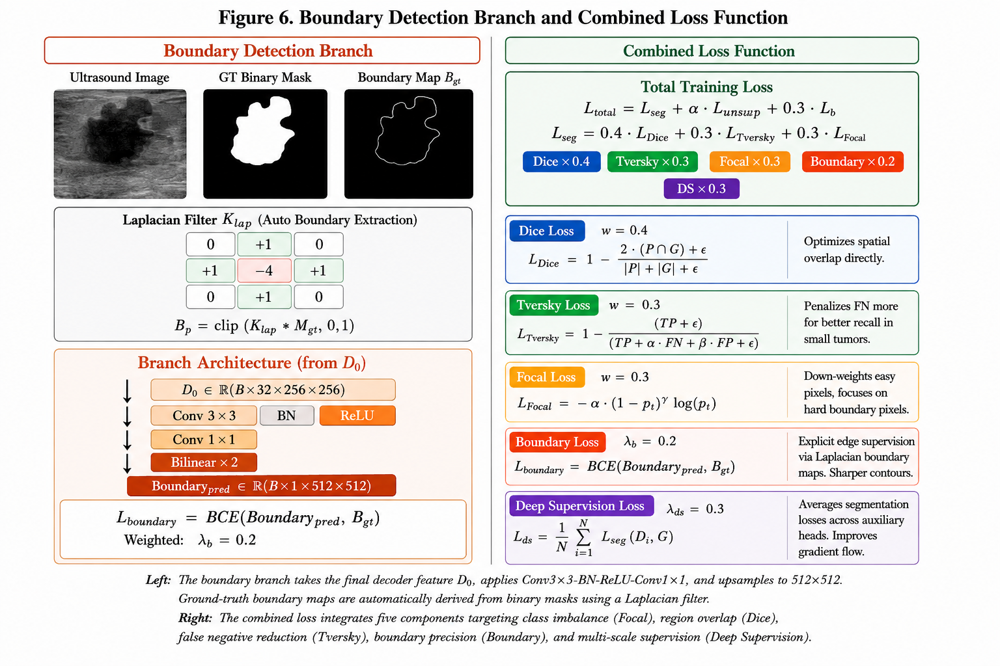
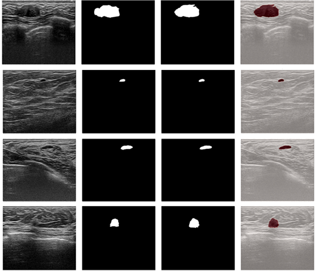

#
SwinM-FPN-Net: A Hybrid Swin Transformer and State Space Model for Accurate Breast Ultrasound Tumor Segmentation
#
Breast ultrasound (BUS) imaging plays a critical role in early cancer detection, yet accurate tumour segmentation remains challenging due to speckle noise, low contrast, and irregular lesion boundaries. In this work, we propose SwinM-FPN-Net, a novel hybrid deep learning (DL) architecture that integrates transformer-based feature extraction with state-space modelling and attention mechanisms for precise tumour segmentation. The proposed framework consists of a Swin Transformer encoder for hierarchical feature extraction, a feature pyramid network (FPN) enhanced with a convolutional block attention module (CBAM) for multi-scale feature refinement, a lightweight Mamba-style State Space Model (SSM) bottleneck for efficient long-range dependency modelling, an attention-gated decoder with deep supervision for accurate reconstruction, and a boundary detection branch for explicit contour learning. The model is evaluated on two benchmark BUS datasets (BUSI and Dataset B). Experimental results demonstrate strong performance, achieving Dice scores of 0.8912 and 0.9226, respectively, along with high specificity exceeding 0.99. The integration of global contextual modelling and boundary-aware learning significantly improves segmentation accuracy, particularly in challenging cases with tumour boundaries. These findings highlight the effectiveness of combining transformer architectures with state-space models for medical image segmentation.
#

#

